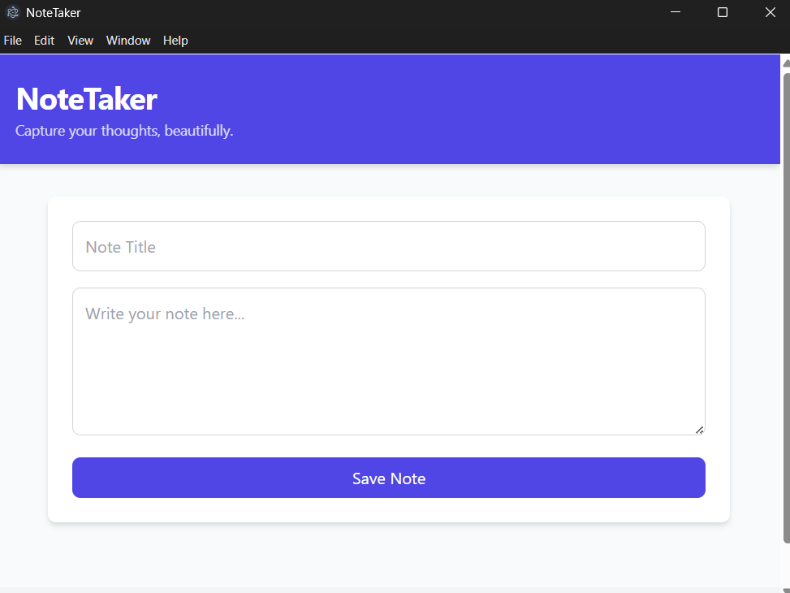

# NoteTaker - A Cross-Platform Desktop Note-Taking App



NoteTaker is a modern, cross-platform desktop application built with **Electron JS** and styled with **Tailwind CSS**. It allows users to create and delete notes with a sleek, responsive user interface. Notes are stored locally in a JSON file for persistence. This project showcases secure Electron development practices, a beautiful UI, and robust file system integration, making it a strong portfolio piece for showcasing desktop app development and UI/UX design.

## Features

- **Create Notes**: Add notes with a title and content using an intuitive input form.
- **Delete Notes**: Remove notes with a single click, updating the UI and storage.
- **Responsive UI**: A modern, card-based interface with hover effects and animations, built with Tailwind CSS.
- **Secure Design**: Implements Content Security Policy (CSP), `contextIsolation`, and `nodeIntegration: false`.
- **Cross-Platform**: Runs on Windows, macOS, and Linux.
- **Debugging Support**: Includes console logging and DevTools for troubleshooting.

## Technologies Used

- **Electron JS**: Framework for cross-platform desktop applications.
- **Tailwind CSS**: Utility-first CSS framework for a modern, responsive UI.
- **fs-extra**: Node.js module for file system operations.
- **JavaScript**: Core logic for renderer and main processes.
- **HTML/CSS**: Structure and styling for the UI.

## Project Structure

```
note-taker/
├── .github/
│   └── ISSUE_TEMPLATE/
│       ├── bug_report.md      # Template for bug reports
│       └── feature_request.md # Template for feature requests
├── index.html                # Main HTML file with UI structure
├── main.js                   # Electron main process (app logic, file system, IPC)
├── preload.js                # Preload script for secure IPC communication
├── renderer.js               # Renderer process for UI interactions
├── styles.css                # Custom CSS for animations and hover effects
├── package.json              # Project metadata and dependencies
├── notes.json                # (Generated) Stores notes in userData directory
├── README.md                 # Project overview and instructions
├── CONTRIBUTING.md           # Guidelines for contributing
├── LICENSE                   # MIT License
└── .gitignore                # Git ignore rules
```

## Setup Instructions

### Prerequisites

- **Node.js** (v16 or higher): [Download](https://nodejs.org/)
- **npm**: Included with Node.js
- A code editor (e.g., VS Code)

### Installation

1.  **Clone the Repository**:

    ```bash
    git clone https://github.com/nutanmishra/note-taker.git
    cd note-taker
    ```

2.  **Install Dependencies**:

    ```bash
    npm install
    ```

    This installs Electron, `fs-extra`, and `electron-builder`.

3.  **Run the Application**:

    ```bash
    npm start
    ```

    This launches NoteTaker in development mode with DevTools open for debugging.

4.  **Build for Distribution** (Optional):
    ```bash
    npm run build
    ```
    Generates installers for Windows (NSIS), macOS (DMG), or Linux (AppImage) in the `dist/` folder.

### File System Notes

- Notes are saved in `notes.json` in the Electron `userData` directory:
  - **Windows**: `C:\Users\<YourUser>\AppData\Roaming\note-taker`
  - **macOS**: `~/Library/Application Support/note-taker`
  - **Linux**: `~/.config/note-taker`
- Ensure the app has write permissions in this directory.

## Usage

1.  **Launch the App**:
    Run `npm start` to open the NoteTaker window.

2.  **Create a Note**:

    - Enter a title and content in the input form.
    - Click **Save Note**.
    - The note appears in the grid as a styled card.

3.  **Delete a Note**:

    - Click **Delete** on a note card to remove it from the UI and `notes.json`.

4.  **Debugging**:
    - Open DevTools (Ctrl+Shift+I or Cmd+Opt+I) to view console logs.
    - Check logs for messages like “Note saved successfully” or errors.
    - Inspect `notes.json` to verify saved notes.

## Example `notes.json`

```json
[
  {
    "title": "Meeting Notes",
    "content": "Discuss project timeline and deliverables.",
    "id": 1623456789012
  }
]
```

## Versioning

NoteTaker uses semantic versioning (e.g., `v1.0.0`). Version history is tracked via Git tags and GitHub releases. Check the [Releases](https://github.com/nutanmishra/note-taker/releases) page for details and downloadable installers.

- **Current Version**: v1.0.0
- **Changelog**:
  - `v1.0.0`: Initial release with note creation and deletion, Tailwind CSS UI, and secure Electron setup.

## Security Features

- **Content Security Policy (CSP)**:
  - Restricts scripts and styles to `'self'` and `https://cdn.jsdelivr.net`.
  - Prevents `unsafe-eval` to mitigate XSS risks.
- **Context Isolation**: Uses `contextIsolation: true` to isolate renderer and main processes.
- **Node Integration Disabled**: Sets `nodeIntegration: false` to prevent direct Node.js access.
- **Preload Script**: Uses `preload.js` with `contextBridge` for secure IPC.

## Contributing

Contributions are welcome! Please read the [CONTRIBUTING.md](CONTRIBUTING.md) file for guidelines. Use the [Bug Report](.github/ISSUE_TEMPLATE/bug_report.md) or [Feature Request](.github/ISSUE_TEMPLATE/feature_request.md) templates in the [Issues](https://github.com/nutanmishra/note-taker/issues) tab.

## Troubleshooting

- **Error: `require is not defined`**:
  - Ensure `main.js` references `preload.js` in `webPreferences.preload`.
  - Verify `renderer.js` uses `window.electronAPI`.
- **CSP Warning**:
  - Confirm the CSP meta tag in `index.html`:
    ```html
    <meta
      http-equiv="Content-Security-Policy"
      content="default-src 'self'; style-src 'self' https://cdn.jsdelivr.net; script-src 'self';"
    />
    ```
- **Notes Not Saving/Deleting**:
  - Check DevTools console for errors (e.g., “Error saving note”).
  - Verify write permissions in the `userData` directory.
  - Delete `notes.json` if corrupted.
- **UI Issues**:
  - Ensure Tailwind CSS CDN (`https://cdn.jsdelivr.net/npm/tailwindcss@2.2.19/dist/tailwind.min.css`) is accessible.
  - Check `styles.css` for custom styles.

## License

This project is licensed under the MIT License. See the [LICENSE](LICENSE) file for details.

## Author

Nutan Mishra  
dev.nutanmishra@gmail.com

---

Built with ❤️ using Electron JS and Tailwind CSS.
